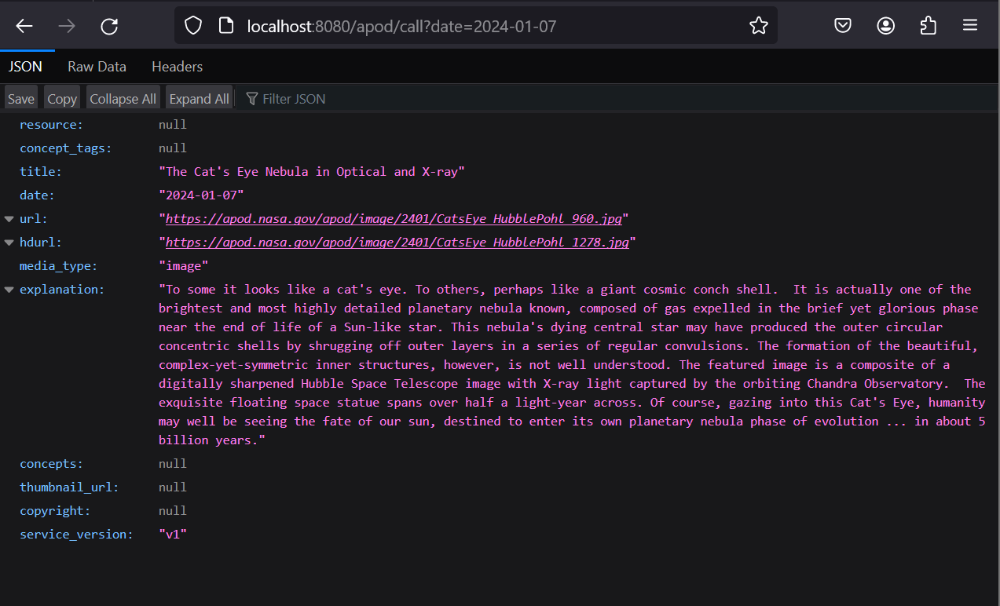
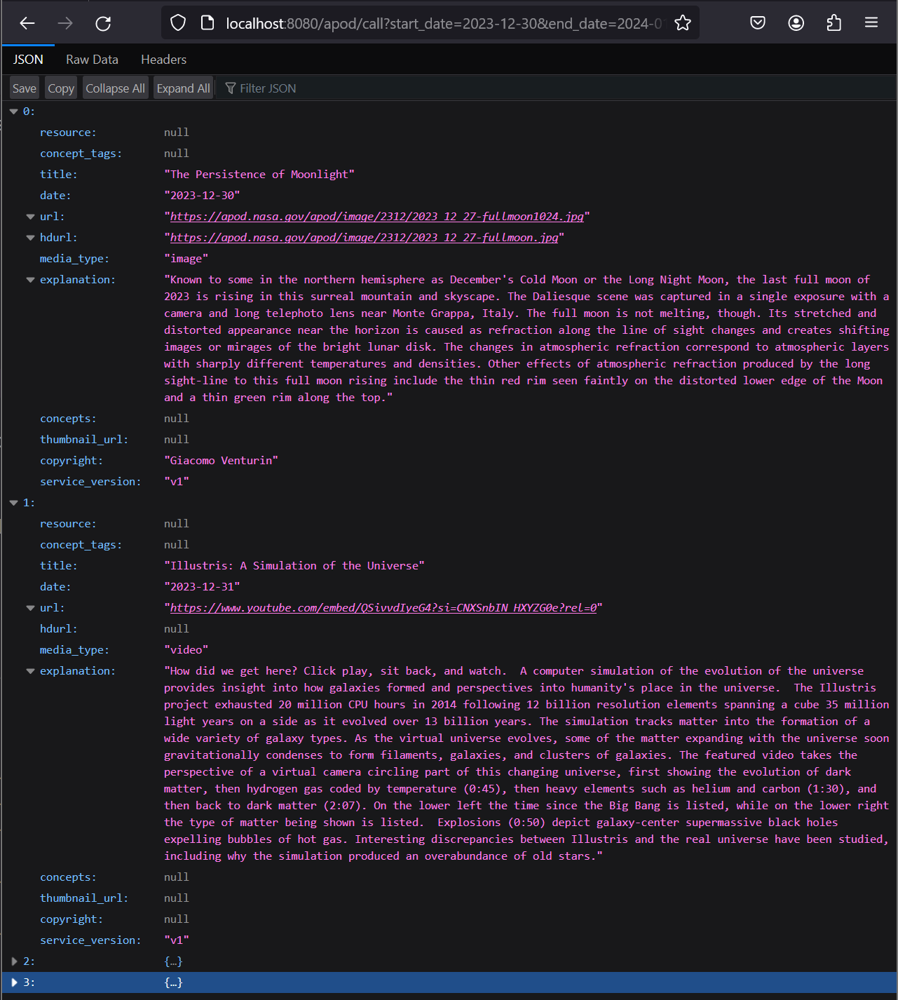
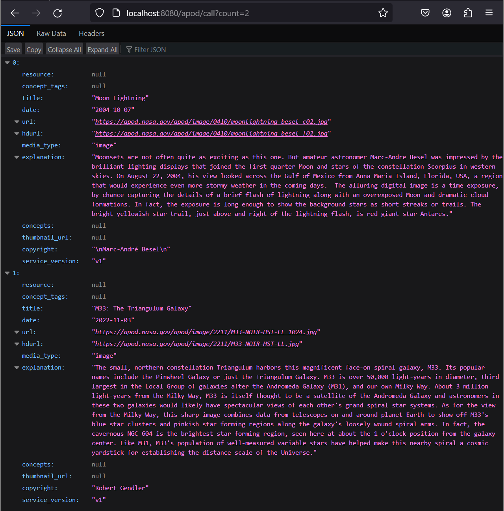
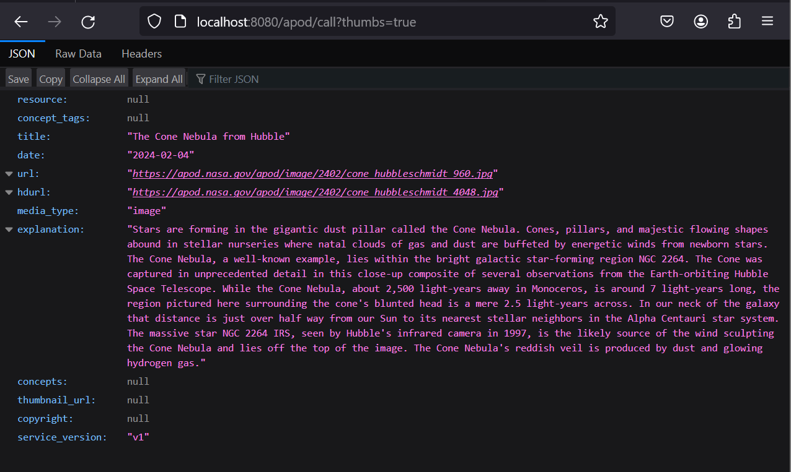

---

# NASA APOD API Integration Project by Swati 

This Spring Boot project demonstrates how to integrate with the NASA Astronomy Picture of the Day (APOD) API. It provides endpoints to fetch the Astronomy Picture of the Day for a given date, a range of dates, or a random set based on the count, with an option to include thumbnail images.

## Features

- Fetch the APOD for a specific date.
- Fetch APOD for a range of dates.
- Fetch a random set of APODs based on a specified count.
- Option to include thumbnail images in the response.

## Setup

### Prerequisites

- Java 17 or later
- Spring 3.2.2
- Gradle 
- An IDE of your choice (e.g., IntelliJ IDEA, Eclipse)
- A valid NASA API key (obtain from [https://api.nasa.gov](https://api.nasa.gov))

### Configuration

1. Clone the repository:

```bash
git clone <https://yourrepositoryurl.git>
cd <your-project-directory>
```

2. Update `src\main\java\com\example\demo\Restcontrollers.java` with your NASA API key at line 43:

```
String apiKey =  "Your_API_Key";
```

3. Run the application:

```bash
gradle bootrun
```

## Usage

After starting the application, it will be accessible at `http://localhost:8080`.

### Endpoints

- **Hello Endpoint**: `GET /apod/hello`
  - Returns a simple hello message.
- **Fetch APOD**: `GET /apod/call`
  - Query Parameters:
    - `date`: The date of the APOD to fetch (format: YYYY-MM-DD).
    - `start_date`: The start date of a date range for APODs.
    - `end_date`: The end date of a date range for APODs.
    - `count`: The number of random APODs to fetch.
    - `thumbs`: Whether to include thumbnail images in the response (`true` or `false`).

### Examples

- Fetch APOD for a specific date:

```http
GET /apod/call?date=2024-02-01
```

- Fetch APOD for a date range:

```http
GET /apod/call?start_date=2024-02-01&end_date=2024-02-05
```

- Fetch a random set of 5 APODs:

```http
GET /apod/call?count=5
```
specific date


between a range of dates


count param is provided in below example


thumbs parameter response is also included



## Contributing

We welcome contributions! Please feel free to submit pull requests or open issues to suggest improvements or add new features.


---